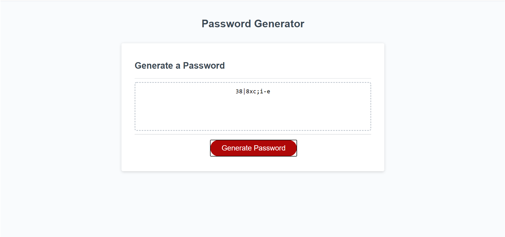

# password_generator

## Background
The objective of this exercise was to create an app that generates a random password when the user clicks on the button.  HTML, CSS, and a basic JS template were provided.

Acceptance criteria is as follows:

```
GIVEN I need a new, secure password
WHEN I click the button to generate a password
THEN I am presented with a series of prompts for password criteria
WHEN prompted for password criteria
THEN I select which criteria to include in the password
WHEN prompted for the length of the password
THEN I choose a length of at least 8 characters and no more than 128 characters
WHEN prompted for character types to include in the password
THEN I choose lowercase, uppercase, numeric, and/or special characters
WHEN I answer each prompt
THEN my input should be validated and at least one character type should be selected
WHEN all prompts are answered
THEN a password is generated that matches the selected criteria
WHEN the password is generated
THEN the password is either displayed in an alert or written to the page
```

## Site Pictures


## Approach

There were several key areas to focus on in this project:
1) How to make sure the users stick within the set min/max parameters
2) How to generate and assign random characters
3) How to make JS interact correctly with HTML (i.e. display correctly on the page)

### Min/Max parameters

The below code was used to prevent a user from continuing before meeting the necessary length criteria:

```
alert("Please enter password criteria on the subsequent screens");
    // cannot proceed until user meets criteria
    while(isNaN(passLength) || passLength < 8 || passLength > 128) {
      passLength = parseInt(prompt("Your password must be 8 - 128 characters in length.  How many characters would you like your password to be (please enter a number from 8 - 128)?")); 
    }
```
To address the length requirement, < and > parameters were set on the while loop.  Additionally, isNAN was utilized to prevent users from entering in characters that are not numbers.

### Generating and assigning random characters

Generating the password is actually a multi-step process.  Once the user defines the length of the password and the desired criteria, an initial numerical value is generated where the number of digits is equal to the length specified by the user and the individual digits are limited to the number of criteria selected.  For example, if the user wants a length of 10 and only 1 criteria is selected, 1111111111 will be the output.

```
// generates a random set of numbers at the desired length with each numerical value limited to the number of criteria selected
      for (var i = 0; i < passLength; i++) {
        var num = Math.floor(Math.random() * need) + 1;
        passDraft.push(num);
        }
```
This generates an array which is then run through a long set of condition statements to identify which criteria object should be applied where.  The criteria objects include functions which then randomly select a character and add it to a string in the finalPassword variable.

```
// for each possible combination of variables, determines which random function needs to generate a character 
      if(lowercase.isNeeded === true && uppercase.isNeeded === true && numeric.isNeeded === true && specChar.isNeeded === true){
          for (var i = 0; i < passLength; i++) {
            if (passDraft[i] === 1) {
                lowercase.letter();
            }
            else if (passDraft[i] === 2) {
                uppercase.letter();
            }
            else if (passDraft[i] === 3) {
                numeric.number();
            }
            else if (passDraft[i] === 4) {
                special.char();
            }
        }
      }
```

```
// functions added to each criteria object to randomly generate values and add to final password
var lowercase = {
  letter : function () {
            var num = lowercaseLetters[Math.floor(Math.random() * lowercaseLetters.length)];
            finalPassword += num;
            },
  isNeeded: true,
}
```
### Interacting with HTML
The initial setup in the JS template was a bit confusing to me so I went with a, at least to me, more straightforward approach of utilizing document.getElementById and onclick to display and trigger password generation, respectively.


## Built With

* [HTML](https://developer.mozilla.org/en-US/docs/Web/HTML)
* [CSS](https://developer.mozilla.org/en-US/docs/Web/CSS)
* [JS](https://developer.mozilla.org/en-US/docs/Web/JavaScript)

## Deployed Link

* [See Live Site](https://cofchips.github.io/password_generator/)


## Authors

* **CHRISTOPHER LEE** 

- [Link to Github](https://github.com/CofChips)
- [Link to LinkedIn](https://www.linkedin.com/in/christophernlee/)

## Acknowledgments

